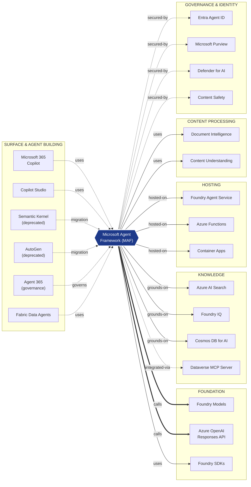
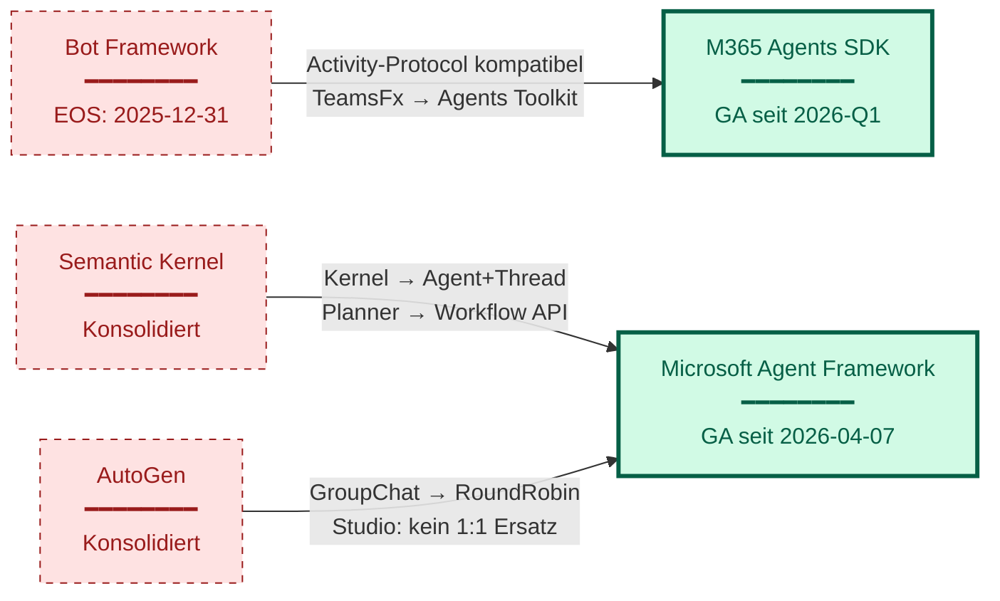
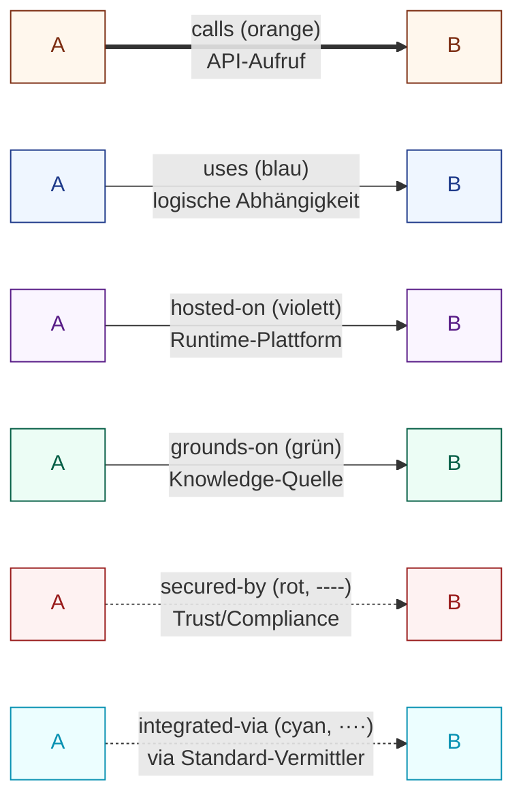
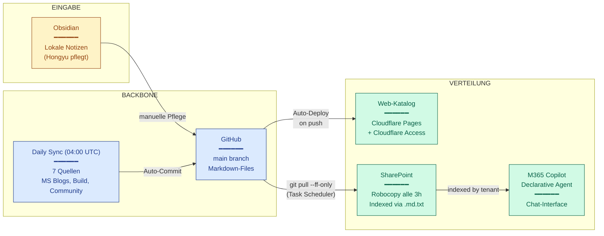
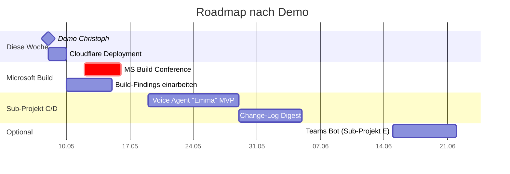
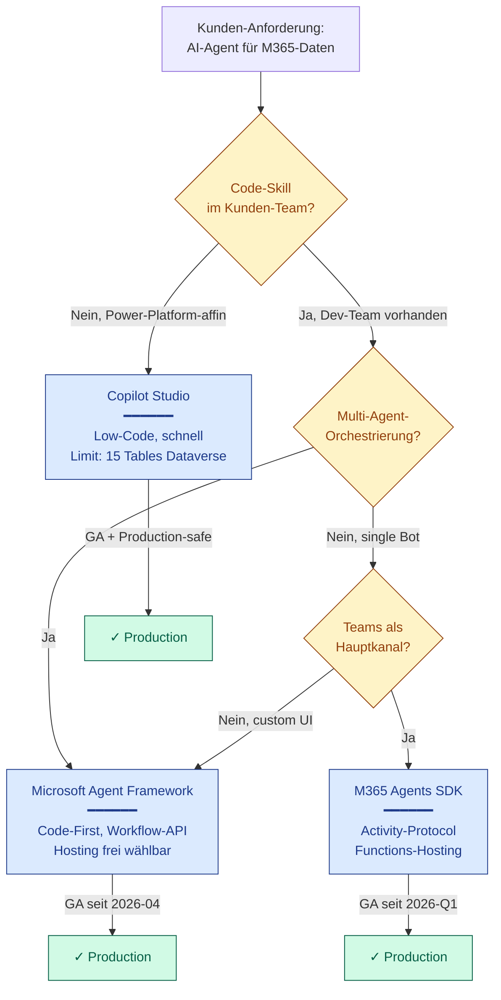

# Highlight-Diagramme — Christoph Demo 2026-05-08

Diese Diagramme dienen als visuelle Stützen für die einzelnen Demo-Blöcke. Wenn die Live-Demo am Bildschirm hakt, sind das die Backup-Folien. Auch nutzbar als Print-Outs zum Mitnehmen für Christoph nach dem Termin.

Mermaid-Diagramme rendern in:
- VS Code mit Mermaid-Extension
- GitHub-Markdown-Preview (direkt online)
- Obsidian mit Mermaid-Plugin
- mermaid.live (online-Editor für Export als PNG/SVG)

---

## Diagramm 1 — 7-Schichten-Übersicht

**Zeitpunkt im Skript:** Block 3 (08:00 – 11:00)
**Zweck:** Wenn die Live-Map nicht lädt, hier die Layer-Struktur als Fallback. Auch als _Slide_ am Anfang gut, um die Big Picture zu setzen.

```mermaid
flowchart TB
    subgraph SURFACE [" "]
        direction LR
        S1["Microsoft 365<br/>Copilot"]
    end
    subgraph AGENT [" "]
        direction LR
        A1["Microsoft Agent<br/>Framework (MAF)"]
        A2["Copilot Studio"]
        A3["M365 Agents SDK"]
        A4["Teams SDK"]
        A5["Power Automate"]
        A6["Bot Framework<br/>(deprecated)"]
        A7["Semantic Kernel<br/>(deprecated)"]
        A8["AutoGen<br/>(deprecated)"]
    end
    subgraph HOSTING [" "]
        direction LR
        H1["Foundry<br/>Agent Service"]
        H2["Azure Functions"]
        H3["Container Apps"]
        H4["APIM AI Gateway"]
        H5["Logic Apps"]
    end
    subgraph KNOWLEDGE [" "]
        direction LR
        K1["Azure AI Search"]
        K2["Foundry IQ"]
        K3["Microsoft Graph"]
        K4["Copilot Connectors"]
        K5["Dataverse"]
        K6["Dataverse MCP"]
        K7["Fabric Data Agents"]
        K8["Cosmos DB for AI"]
    end
    subgraph CONTENT [" "]
        direction LR
        C1["Document Intelligence"]
        C2["Content Understanding"]
    end
    subgraph GOVERNANCE [" "]
        direction LR
        G1["Entra Agent ID"]
        G2["Agent 365"]
        G3["Entra Suite"]
        G4["Purview"]
        G5["Purview DSPM"]
        G6["Purview Data Map"]
        G7["Defender for AI"]
        G8["Content Safety"]
    end
    subgraph FOUNDATION [" "]
        direction LR
        F1["Microsoft Foundry"]
        F2["Foundry Models"]
        F3["Control Plane"]
        F4["Foundry SDKs"]
        F5["Foundry Local"]
        F6["Model Context<br/>Protocol (MCP)"]
        F7["Azure OpenAI<br/>Responses API"]
    end

    SURFACE ~~~ AGENT ~~~ HOSTING ~~~ KNOWLEDGE ~~~ CONTENT ~~~ GOVERNANCE ~~~ FOUNDATION

    classDef surface fill:#fef3c7,stroke:#0066cc,color:#0066cc
    classDef agent fill:#dbeafe,stroke:#2563eb,color:#2563eb
    classDef hosting fill:#f3e8ff,stroke:#7c3aed,color:#7c3aed
    classDef knowledge fill:#d1fae5,stroke:#059669,color:#059669
    classDef content fill:#cffafe,stroke:#0891b2,color:#0891b2
    classDef governance fill:#fee2e2,stroke:#dc2626,color:#dc2626
    classDef foundation fill:#fed7aa,stroke:#9a3412,color:#9a3412

    class S1 surface
    class A1,A2,A3,A4,A5,A6,A7,A8 agent
    class H1,H2,H3,H4,H5 hosting
    class K1,K2,K3,K4,K5,K6,K7,K8 knowledge
    class C1,C2 content
    class G1,G2,G3,G4,G5,G6,G7,G8 governance
    class F1,F2,F3,F4,F5,F6,F7 foundation
```

**Skript-Hinweis:**
> _"Sieben Schichten. Von oben nach unten: User-Touchpoint, Agent-Building, Hosting, Knowledge, Content Processing, Governance, Foundation. Diese Trennung ist meine — Microsoft präsentiert nach Marken-Familien, wir nach Funktion."_

---

## Diagramm 2 — MAF als Hub (Kern-Talking-Point)

**Zeitpunkt im Skript:** Block 5 (13:00 – 17:00)
**Zweck:** Das ist **der** Wow-Moment der Demo. MAF mit allen 13 ausgehenden + 5 eingehenden Verbindungen.

**Skript-Hinweis:**
> _"MAF hat mehr eingehende und ausgehende Verbindungen als jeder andere Knoten. Das ist kein Zufall — MAF ist der Hub des modernen Microsoft-Agent-Stacks."_

**Zahlen für die Pause:**
- 6 eingehende Edges
- 13 ausgehende Edges
- Insgesamt 19 Verbindungen → mehr als die Top-3-anderen-Knoten zusammen

---

## Diagramm 3 — Deprecation-Migrations-Pfade

**Zeitpunkt im Skript:** Block 6 (17:00 – 20:00)
**Zweck:** Die Migrations-Geschichte für Kunden mit Bestandscode.

**Skript-Hinweis:**
> _"Bot Framework wandert nach M365 Agents SDK. Semantic Kernel und AutoGen wandern nach MAF. Diese drei Pfeile sind die Migrations-Pfade, die wir bei jedem Microsoft-Bestandskunden im Gespräch haben."_

**Talking-Points während dieser Folie:**
- Bot Framework EOS ist hart — **31. Dezember 2025**
- Activity-Protocol bleibt → kein Code-from-scratch nötig
- AutoGen Studio (UI) hat **keinen** 1:1-Ersatz → Punkt für Migration-Beratung

---

## Diagramm 4 — Edge-Typen-Legende

**Zeitpunkt im Skript:** Block 4 (11:00 – 13:00)
**Zweck:** Sechs Beziehungstypen visuell auf einen Blick. Auch als Druck-Print-Out für Christoph nach Demo gut.

**Skript-Hinweis:**
> _"Sechs Beziehungstypen, jeder mit eigener Farbe und Linien-Charakter. Pfeile zeigen Richtung. Hover öffnet rechts das Detail-Panel."_

---

## Diagramm 5 — Pflege-Pipeline

**Zeitpunkt im Skript:** Block 8 (22:00 – 25:00)
**Zweck:** Wie das System sich selbst aktualisiert — Single-Source-of-Truth + automatische Verteilung.

**Skript-Hinweis:**
> _"Ich pflege an einer Stelle, drei Kanäle aktualisieren sich automatisch. Web-Katalog für externe Stakeholder, SharePoint plus Copilot für interne Chat-Anfragen, GitHub als History und Backup."_

---

## Diagramm 6 — Roadmap-Zeitstrahl

**Zeitpunkt im Skript:** Block 9 (25:00 – 29:00)
**Zweck:** Visualisierung der nächsten 4 Wochen. Optional als finale Folie.

**Skript-Hinweis:**
> _"Voice Agent Emma als nächstes grosses Stück. Microsoft Build als Wissens-Auffrischung. Change-Log Digest als nächste Iteration. Teams Bot bewusst nach hinten priorisiert."_

---

## Backup-Diagramm — Decision-Tree für "Welcher Agent-Pfad?"

**Zweck:** Wenn Christoph fragt _"Wann nehmen wir was?"_ — diese Folie hat die Antwort.

**Skript-Hinweis (falls Frage kommt):**
> _"Es gibt drei Haupt-Pfade. Copilot Studio für Low-Code-Kunden. M365 Agents SDK für Teams-zentrische Bots. MAF für komplexe Multi-Agent-Lösungen. Die Map zeigt, wie sie alle die gleichen Foundation-Services nutzen — der Wechsel später ist nicht ein Re-Write, sondern ein Re-Wiring."_

---

## Druck-Strategie

**Was als Print-Out für Christoph gut wäre:**
1. Diagramm 1 (7-Schichten-Übersicht) — **DIN A3 quer**, an die Wand zum Reinschauen
2. Diagramm 4 (Edge-Typen-Legende) — A4, klein, als Stick-Out neben dem Bildschirm
3. Diagramm 7 (Decision-Tree) — A4, in der Kunden-Akquise-Mappe

**Export aus Mermaid → PNG:**
1. Inhalt jedes Diagramms in https://mermaid.live einfügen
2. "Actions" → "PNG" oder "SVG"
3. Falls Print-Tauglichkeit wichtig: SVG, dann in Affinity/Inkscape öffnen, A3 exportieren
